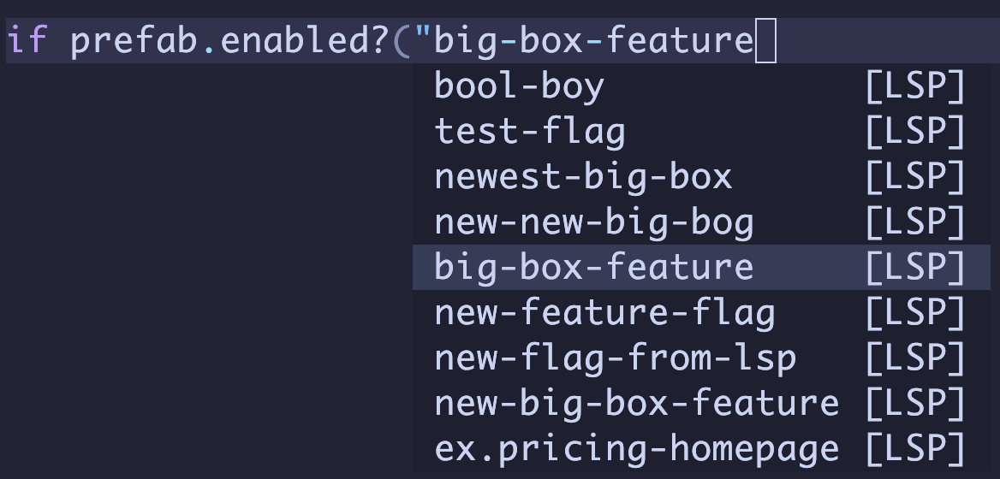
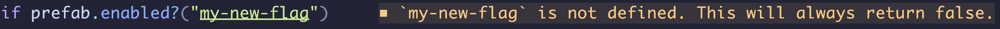
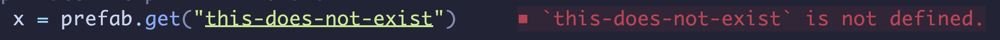
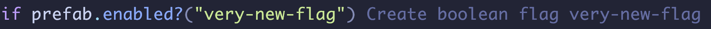
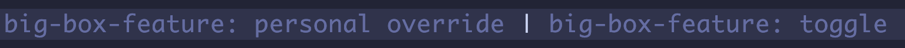

# prefab.nvim

Neovim LSP functionality for [Prefab](https://prefab.cloud/)

## features

- Flag/Config name completion 
- Diagnostics  
- Code lenses  

## Installation

First, using node >= 18, do `npm install -g @prefab-cloud/prefab-cloud-language-server`

You can configure neovim using the package manager of your choice. Here's a couple examples:

Using [lazy.nvim](https://github.com/folke/lazy.nvim)

```lua
{
    "prefab-cloud/prefab.nvim",
    config = function()
        require("prefab").setup({
            opt_in = {extractString = true}
        })
    end
}
```

Using [vim-plug](https://github.com/junegunn/vim-plug)

```vim
Plug 'prefab-cloud/prefab.nvim'

" ... later, after your call plug#end()

lua << EOF
require("prefab").setup({
    opt_in = {extractString = true}
})
EOF
```

For completions from the language server (e.g. flag names) you might want to install [nvim-cmp](https://github.com/hrsh7th/nvim-cmp) or similar.

## Setup

Using `require("prefab").setup`, you can pass a number of options

| option                         | type     | usage                                                                                        |
| ------------------------------ | -------- | -------------------------------------------------------------------------------------------- |
| `prefab_api_key`               | string   | Specify your Prefab api key. Defaults to ENV var `PREFAB_API_KEY`                            |
| `on_attach`                    | function | Allows specifying keybindings, etc. after the language server attaches                       |
| `opt_in`                       | table    | Allows opting-in to beta features                                                            |
| `file_pattern`                 | array    | Specify a custom list of extensions you want to automatically attach to. e.g. `{ "*.html" }` |
| `get_input_func`               | function | Specify a custom synchronous UI function to get dynamic input                                |
| `skip_responsiveness_handlers` | boolean  | Specify `true` to skip some functions that make Neovim's LSP handlers more responsive        |
